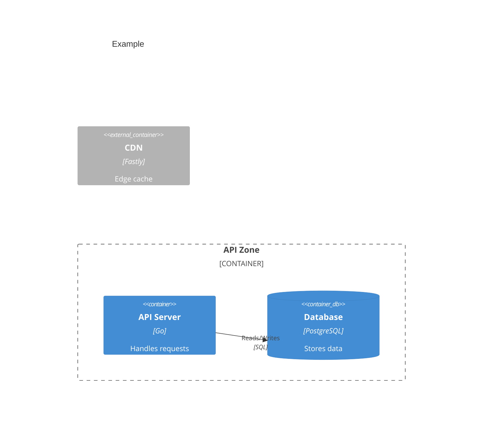

# Mermaid C4 Reference Guide

This reference defines every valid C4 macro, label rules, and a structured error-recovery
procedure. Follow it exactly to produce diagrams that validate on the first `mmdc` run.

## Valid C4 Macros (Whitelist)

Use **only** macros from this list. Any other identifier causes a
"Lexical error: Unrecognized text" failure.

### People / Actors
| Macro | Usage |
|-------|-------|
| `Person(alias, "Name", "Description")` | Internal person |
| `Person_Ext(alias, "Name", "Description")` | External person |

### Systems (C1 / C4Context)
| Macro | Usage |
|-------|-------|
| `System(alias, "Name", "Description")` | Internal system |
| `System_Ext(alias, "Name", "Description")` | External system |
| `SystemDb(alias, "Name", "Description")` | Internal database system |
| `SystemDb_Ext(alias, "Name", "Description")` | External database system |
| `SystemQueue(alias, "Name", "Description")` | Internal queue system |
| `SystemQueue_Ext(alias, "Name", "Description")` | External queue system |

### Containers (C2 / C4Container only)
| Macro | Usage |
|-------|-------|
| `Container(alias, "Name", "Tech", "Description")` | Internal container |
| `Container_Ext(alias, "Name", "Tech", "Description")` | External container |
| `ContainerDb(alias, "Name", "Tech", "Description")` | Internal database container |
| `ContainerDb_Ext(alias, "Name", "Tech", "Description")` | External database container |
| `ContainerQueue(alias, "Name", "Tech", "Description")` | Internal queue container |
| `ContainerQueue_Ext(alias, "Name", "Tech", "Description")` | External queue container |

### Components (C3 / C4Component only)
| Macro | Usage |
|-------|-------|
| `Component(alias, "Name", "Tech", "Description")` | Internal component |
| `Component_Ext(alias, "Name", "Tech", "Description")` | External component |
| `ComponentDb(alias, "Name", "Tech", "Description")` | Internal database component |
| `ComponentDb_Ext(alias, "Name", "Tech", "Description")` | External database component |
| `ComponentQueue(alias, "Name", "Tech", "Description")` | Internal queue component |
| `ComponentQueue_Ext(alias, "Name", "Tech", "Description")` | External queue component |

### Boundaries
| Macro | Usage |
|-------|-------|
| `Boundary(alias, "Label") { }` | Generic boundary |
| `Boundary(alias, "Label", "type") { }` | Typed boundary — type must be a **quoted string** |
| `Enterprise_Boundary(alias, "Label") { }` | Enterprise boundary |
| `System_Boundary(alias, "Label") { }` | System boundary |
| `Container_Boundary(alias, "Label") { }` | Container boundary |

Valid `type` strings: `"dashed"`, `"solid"`. An unquoted identifier (e.g., `dashed` without
quotes) is a parse error.

### Relationships
| Macro | Usage |
|-------|-------|
| `Rel(from, to, "Label")` | Directed relationship |
| `Rel(from, to, "Label", "Technology")` | Directed with technology annotation |
| `Rel_Back(from, to, "Label")` | Reverse direction |
| `Rel_Neighbor(from, to, "Label")` | Adjacent (reduces crossing lines) |
| `Rel_Back_Neighbor(from, to, "Label")` | Reverse adjacent |
| `BiRel(from, to, "Label")` | Bidirectional |

**Never use `-->` or `->` in C4 blocks** — those are flowchart-only syntax and will cause
a parse error in `C4Context`, `C4Container`, and `C4Component` blocks.

### Layout
```
UpdateLayoutConfig($c4ShapeInRow="3", $c4BoundaryInRow="1")
```
Always include this as the **last line** of every diagram.

---

## Label Character Rules

- All string arguments must use **double quotes** (`"…"`), never single quotes.
- The following characters inside a label string **must** be replaced with HTML entities:
  - `"` → `#quot;`
  - `<` → `#lt;`
  - `>` → `#gt;`
  - `&` → `#amp;`
- The following are safe unescaped inside double-quoted strings: alphanumeric, spaces, `-`, `_`,
  `.`, `,`, `!`, `?`, `/`, `@`, `:`, `(`, `)`.

---

## Block-Type Selection

| Sprint scope | Block keyword |
|-------------|---------------|
| C1 System Context | `C4Context` |
| C2 Container | `C4Container` |
| C3 Component | `C4Component` |

---

## Boundary Placement Rule

Elements inside a `Boundary` block **must be defined inside its `{ }` block**.
You cannot declare an element before the boundary and then reference it by alias inside the
boundary — that is a parse error. Plan all groupings before writing the diagram.



---

## Structured Error Recovery Procedure

When `mmdc -i <file> -o /tmp/validate.svg` exits non-zero, follow these steps exactly:

### Step 1 — Capture the full error
```bash
mmdc -i <absolute-file-path> -o /tmp/validate.svg 2>&1 | head -40
```

### Step 2 — Read the error output
The error names a line number and the unexpected token, for example:
```
Error: Parse error on line 14:
...ContainerQueue_Ext(q, "Job Queue"
-----------------------^
Expecting 'NEWLINE', got 'INVALID'
```

### Step 3 — Read that line in the file
Use the Read tool to view the file. Go to the reported line number.

### Step 4 — Identify the failure cause (check in order)
1. **Unknown macro** — Is the identifier at that line in the whitelist above? If not, replace
   it with the closest valid macro.
2. **Flowchart arrow** — Does the line contain `-->` or `->`? Replace with a `Rel()` call.
3. **Unquoted boundary type** — Does a `Boundary(...)` call have an unquoted third argument?
   Add double quotes around it.
4. **Unescaped entity** — Does a label string contain `<`, `>`, `"`, or `&`? Replace with the
   HTML entity equivalents listed above.
5. **Missing closing brace** — Does a `Boundary` block lack a matching `}`? Add it.

### Step 5 — Fix the one reported line only
Use the Edit tool to change only the specific line. Do NOT rewrite the whole diagram.

### Step 6 — Re-validate
```bash
mmdc -i <absolute-file-path> -o /tmp/validate.svg 2>&1 | head -40
```
If it exits non-zero again, repeat from Step 2 with the new error. If it exits 0, continue.

---

## Pre-writing Checklist

Run through this before writing the final diagram to a file:

- [ ] Every element macro appears in the whitelist above
- [ ] All string arguments use double quotes
- [ ] All Boundary-contained elements are defined *inside* `{ }`, not before it
- [ ] No `-->` or `->` arrows — only `Rel()` / `BiRel()` / `Rel_Back()` etc.
- [ ] Boundary `type` argument (if used) is a quoted string: `"dashed"` or `"solid"`
- [ ] Labels containing `<`, `>`, `"`, or `&` use HTML entities
- [ ] Last line is `UpdateLayoutConfig($c4ShapeInRow="3", $c4BoundaryInRow="1")`
- [ ] Block keyword matches the sprint scope (C4Context / C4Container / C4Component)
